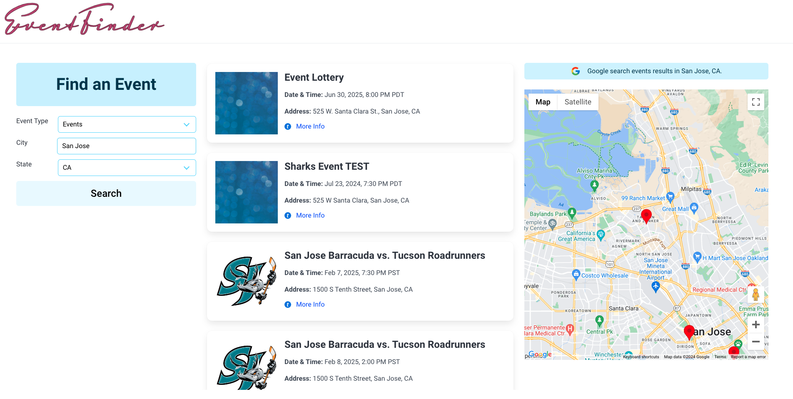
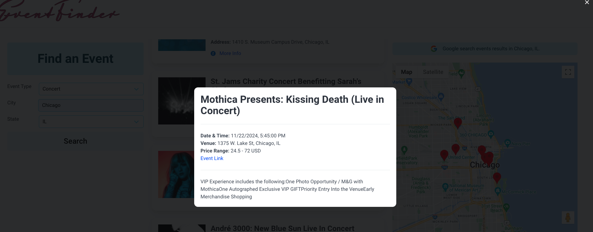

# event-finder Project 1 

# Description

The Event-Finder App is a sophisticated web application designed to streamline the process of discovering events based on user preferences. Users can enter their desired event type, city, and state, and the app presents a curated list of events displayed on interactive cards. Each card offers a summary and a more info button that provides detailed information about the event date, time, price, and a link to the actual Ticketmaster Events if available and a description of event including (event themes, age allowance, uniform etc). Additionally, the app features an interactive Google Map that shows all event locations with pin drops on a map, and a Google search button for direct access to Google Events search results.

# Overview 

The primary motivation behind developing the Event-Finder App was to address the  time-consuming process of finding and selecting events to attend. By integrating data from Ticketmaster and Google Maps API’s, the app aims to provide a comprehensive and user-friendly solution that enhances the event discovery experience. The development of this app also served as an opportunity for us  Preksha, Amrita, and Kim, to apply our web development skills and showcase our ability to create an innovative and functional application that meets real-world needs.

# User story

“As an event enthusiast, I often find it challenging to keep track of all the events happening in my city or places I plan to visit. With the Event-Finder App, I can easily input my desired event type and location to discover events that match my interests. The app displays events on interactive cards, allowing me to quickly scan through and find what catches my eye. When I click on a card, I receive detailed information about the event, including the theme, date, time, and price. Additionally, if the event is listed on Ticketmaster, I can navigate directly to the Ticketmaster events page for more details. The app also features a Google search button, which takes me directly to the Google events search page for the specified city and event type, making it even easier to explore more options and stay updated on all the happenings.”

# Acceptance Criteria 

* Given a Event –finder dashboard with form inputs

* When I search for an event type ,  city and state 

* Then I am presented with current and future events for that city.

* Given the list of events for a city,

* When I view an event card,

* Then I am presented with the event title, event date, and a button for more info.

* Given an event card,

* When I press the more info button,

* Then I am presented with the event title, event date and time, price, Ticketmaster link, and description.

* Given an event with location details,

* When I look for the location of the event,

* Then I can view it on the map with a pin drop on the location and also in the event card.

* Given the Event-Finder dashboard,

* When I click the Google Search button on top of the map,

* Then the page is directed to the Google event search page for the event type and event city from the form input.

# File Structure

* index.html

* ./assets/script.js

* ./assets/style.js

* images

* Readme

# Features 

* Displays 10 events sourced from TicketMaster on page load based on user’s current location. 

* Displays 10 events sourced from TicketMaster based on user input of event type, city and state.

* Displays a dynamically generated Google search results link based on event type, city and state.

* Displays event details - title, address and time on interactive cards.

* Displays an icon to indicate to users the platform (Ticketmaster/Google) from where the event data was sourced.

* Provides a ‘More info’ link which opens a modal displaying additional information such as price, link to the event page and general information about the event. 

* Plots the event addresses on a map for easy visualization.

* Highlights the corresponding location marker on the map when hovering over an event card.

* Displays the corresponding address information in a pop up window when a marker on the map is clicked.

# Getting Started 

* To get started with the Task Board, simply download or clone the repository and open index.html in your web browser . No additional setup is required.

# Usage 

* Click allow when pop up asks for taking ur location 

* Enter your event type , city and state and press search 

* Scroll up / down to see the events in the event cards 

* Hover through event cards to see location highlighted on the map 

* Click "More info " for more information about price , link and description on the card 

* Click Search google events to search for events on google search 

# Screenshots 

# Links 

* Deployed App :   

* GitHub Repo : 

